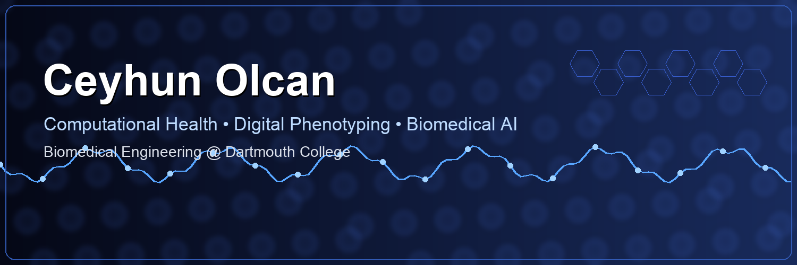

# Ceyhun Olcan

Biomedical Engineering @ Dartmouth College

Computational health researcher focused on digital phenotyping, passive sensing, longitudinal health modeling, wearable signal analysis, behavioral foundation models, computational psychiatry, and climate-health systems.

---

## Current Affiliations

- AIM HIGH Lab @ Geisel School of Medicine
- Empower Lab @ Dartmouth Engineering
- Biomedical Engineering @ Dartmouth College

---

## Active Research Repositories

### [longitudinal-health-foundation-model](https://github.com/ceyhunolcan/longitudinal-health-foundation-model)

Self-supervised multimodal foundation model for longitudinal behavioral health modeling using wearable, smartphone, and environmental data.

### [biomedical-signal-forensics-lab](https://github.com/ceyhunolcan/biomedical-signal-forensics-lab)

Open-source toolkit for wearable physiological signal auditing, algorithmic fairness evaluation, and downstream-task robustness analysis.

### [od-activity-rhythm](https://github.com/ceyhunolcan/od-activity-rhythm)

Analysis pipeline for olfactory dysfunction, circadian rhythm fragmentation, and activity reduction using NHANES data.

### [aegis-controlrisk-v2](https://github.com/ceyhunolcan/aegis-controlrisk-v2)

Risk analytics and strategic systems modeling engine.

---

## Selected Research Directions

- Reliability of passive sensing data in depression
- Longitudinal health foundation models for behavioral forecasting
- Wearable and smartphone-based digital biomarkers
- Environmental and physiological confounding in health AI
- Climate-health and mental health risk modeling
- Fairness, robustness, and interpretability in biomedical AI

---

## Research Interests

- Computational Psychiatry
- AI for Healthcare
- Digital Biomarkers
- Wearable Health Sensing
- Foundation Models for Medicine
- Longitudinal Health Forecasting
- Behavioral Signal Processing
- Climate & Mental Health

---

## Publications

- Preprints in preparation
- medRxiv submissions underway

---

## Tech Stack

---

## Links

- ORCID: https://orcid.org/0000-0002-6326-6071
- LinkedIn: https://www.linkedin.com/in/ceyhun-olcan/
- Website: https://xclimate.co

---

## GitHub Stats

---

## Contribution Activity

