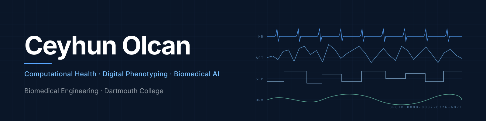

### Ceyhun Olcan

*Biomedical Engineering · Dartmouth College*

<a href="https://xclimate.co">Website</a> &nbsp;·&nbsp;
<a href="https://orcid.org/0000-0002-6326-6071">ORCID</a> &nbsp;·&nbsp;
<a href="https://www.linkedin.com/in/ceyhun-olcan/">LinkedIn</a>

---

## About

Can passive signals from phones, wearables, and the environment reliably model behavioral health over months and years? My work builds the methods, audits, and foundation models needed to answer that — with a focus on reliability, fairness, and clinical translation.

> **Now** — pretraining a longitudinal multimodal foundation model, and in parallel building the audit toolkit for the wearable signals it depends on.

**Affiliations**

| Lab | Institution |
|---|---|
| AIM HIGH Lab | Geisel School of Medicine |
| Empower Lab | Thayer School of Engineering |
| Biomedical Engineering | Dartmouth College |

---

## Preprints

**[Reliability of Passive Sensing Data: A Multi-Method Evaluation in Depression](https://doi.org/10.31234/osf.io/uydqj_v1)**  
Langener, Lee, Castro-Alvarez, Lampe, Enbar-Salo, Ramrakhiani, **Olcan**, Dorris, Price, Heinz, et al. — *PsyArXiv*, May 2026.  
Multi-method evaluation of how reliably wearable and smartphone passive sensing capture signal in depression.

**[Smartphone Missingness as a Depression Biomarker: A Baseline-Controlled Re-analysis of StudentLife](https://doi.org/10.64898/2026.04.30.26351977)**  
**Olcan, C.** — *medRxiv*, May 2026.  
Tests whether smartphone data missingness — typically treated as a nuisance — itself functions as a depression biomarker, via a baseline-controlled re-analysis of the StudentLife cohort.

**[Moderate-to-severe olfactory dysfunction marks accelerated phenotypic aging in U.S. adults](https://doi.org/10.21203/rs.3.rs-9646723/v1)**  
**Olcan, C.** — *Research Square*, May 2026.  
Population-scale evidence that moderate-to-severe olfactory dysfunction tracks with accelerated phenotypic aging.

Full list maintained on [ORCID](https://orcid.org/0000-0002-6326-6071).

---

## Active code

**[longitudinal-health-foundation-model](https://github.com/ceyhunolcan/longitudinal-health-foundation-model)**  
Self-supervised pretraining over months of wearable, smartphone, and environmental streams, built for transfer to downstream behavioral-health forecasting.

**[biomedical-signal-forensics-lab](https://github.com/ceyhunolcan/biomedical-signal-forensics-lab)**  
Toolkit for auditing wearable physiological signals — quality, drift, demographic fairness, and how each propagates into downstream model error. Methodological companion to the *Reliability of Passive Sensing* preprint.

**[od-activity-rhythm](https://github.com/ceyhunolcan/od-activity-rhythm)**  
NHANES analysis pipeline linking olfactory dysfunction to circadian rhythm fragmentation and activity reduction. Companion code to the *Olfactory Dysfunction & Phenotypic Aging* preprint.

**[aegis-controlrisk-v2](https://github.com/ceyhunolcan/aegis-controlrisk-v2)**  
Risk analytics and strategic systems modeling engine.

---

## Currently thinking about

- How reliable is passive sensing as a depression biomarker under everyday adherence drift?
- What pretraining objectives transfer best across heterogeneous wearable cohorts?
- Where does climate exposure enter the causal graph between environment, behavior, and mood?
- What does an honest fairness audit of a wearable health model actually look like?

---

## Toolchain

`Python` · `PyTorch` · `scikit-learn` · `pandas` · `NumPy` · `Linux` · `Git` · `Streamlit`

---

Hanover, NH · Open to research collaborations

