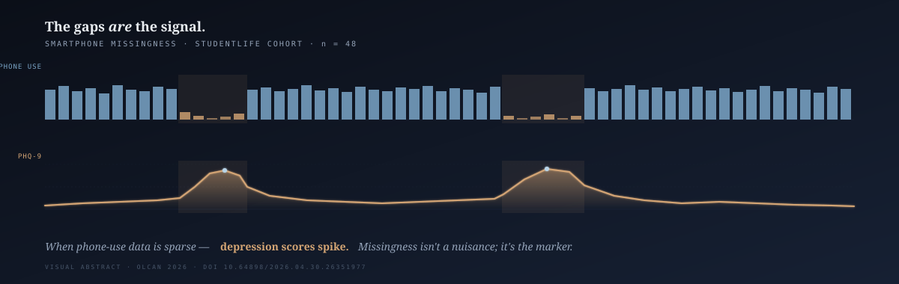

<!-- ============================================================ -->
<!--   §  CEYHUN OLCAN — PROFILE README                          -->
<!--   §  6 parts. Only on services that actually stay up.       -->
<!-- ============================================================ -->

<!-- ─── PART 1 · HEADER ─────────────────────────────────────── -->

<p align="center">
  <a href="https://xclimate.co">
    
  </a>
</p>

<p align="center">
  <a href="https://github.com/ceyhunolcan">
    
  </a>
</p>

<p align="center">
  
  
  
  
</p>

<p align="center">
  <a href="https://xclimate.co"></a>
  <a href="https://orcid.org/0000-0002-6326-6071"></a>
  <a href="https://scholar.google.com/"></a>
  <a href="https://www.linkedin.com/in/ceyhun-olcan/"></a>
  <a href="https://bsky.app/"></a>
</p>

<p align="center"></p>

<!-- ─── PART 2 · ABOUT ──────────────────────────────────────── -->

## § About

<table>
<tr>
<td width="60%" valign="top">

Can passive signals from phones, wearables, and the environment **reliably** model behavioral health over months and years?

My work builds the **methods**, **audits**, and **foundation models** needed to answer that — with a focus on reliability, fairness, and clinical translation. I sit at the intersection of biomedical engineering, computational psychiatry, and climate–health systems.

The field is moving fast on capability; my bet is that what makes these systems actually deployable is the unglamorous infrastructure underneath — signal forensics, drift monitoring, fairness audits, and honest evaluation.

</td>
<td width="40%" valign="top">

```yaml
location:   Hanover, NH
program:    Biomedical Engineering
institution: Dartmouth College
labs:
  - AIM HIGH Lab (Geisel)
  - Empower Lab (Thayer)
status:     pretraining v1 · auditing
open_to:    collaborations, PhD talks
```

</td>
</tr>
</table>

<p align="center"></p>

<!-- ─── PART 3 · RESEARCH ───────────────────────────────────── -->

## § Research

<p align="center">
  
</p>

### Selected Preprints

> **[Reliability of Passive Sensing Data: A Multi-Method Evaluation in Depression](https://doi.org/10.31234/osf.io/uydqj_v1)** &nbsp; *PsyArXiv, 2026*
> Langener, Lee, Castro-Alvarez, Lampe, Enbar-Salo, Ramrakhiani, **Olcan**, Dorris, Price, Heinz, et al.
> How reliably do wearable and smartphone passive sensing actually capture signal in depression? A multi-method evaluation.

> **[Smartphone Missingness as a Depression Biomarker](https://doi.org/10.64898/2026.04.30.26351977)** &nbsp; *medRxiv, 2026*
> **Olcan, C.**
> Reframes smartphone data missingness — usually treated as a nuisance — as itself a depression biomarker, via a baseline-controlled re-analysis of the StudentLife cohort.

> **[Moderate-to-Severe Olfactory Dysfunction Marks Accelerated Phenotypic Aging in U.S. Adults](https://doi.org/10.21203/rs.3.rs-9646723/v1)** &nbsp; *Research Square, 2026*
> **Olcan, C.**
> Population-scale evidence that moderate-to-severe olfactory dysfunction tracks with accelerated phenotypic aging.

<sub>Full list on [**ORCID**](https://orcid.org/0000-0002-6326-6071) and [**Google Scholar**](https://scholar.google.com/).</sub>

<p align="center"></p>

<!-- ─── PART 4 · FEATURED + CODE ────────────────────────────── -->

## § Featured Work

<p align="center">
  <a href="https://doi.org/10.64898/2026.04.30.26351977">
    
  </a>
</p>

In passive-sensing studies, **missing data is treated as noise** — something to impute, weight, or drop. This paper shows the opposite: in a re-analysis of the StudentLife cohort, *sparse* days carry depression signal that *dense* days don't. The mechanism is intuitive once you see it. Depressed individuals withdraw — fewer screen unlocks, fewer SMS, fewer app launches. **The missingness pattern itself is the symptom, not a measurement failure.**

<p>
  <a href="https://doi.org/10.64898/2026.04.30.26351977"></a>
  <a href="https://github.com/ceyhunolcan/biomedical-signal-forensics-lab"></a>
</p>

### Active Code

<table>
<tr>
<td width="50%" valign="top">

#### [longitudinal-health-foundation-model](https://github.com/ceyhunolcan/longitudinal-health-foundation-model)

<a href="https://github.com/ceyhunolcan/longitudinal-health-foundation-model"></a>
<a href="https://github.com/ceyhunolcan/longitudinal-health-foundation-model/commits/main"></a>

Self-supervised pretraining over months of wearable, smartphone, and environmental streams. Built for transfer to downstream behavioral-health forecasting.

</td>
<td width="50%" valign="top">

#### [biomedical-signal-forensics-lab](https://github.com/ceyhunolcan/biomedical-signal-forensics-lab)

<a href="https://github.com/ceyhunolcan/biomedical-signal-forensics-lab"></a>
<a href="https://github.com/ceyhunolcan/biomedical-signal-forensics-lab/commits/main"></a>

Auditing toolkit for wearable physiological signals — quality, drift, demographic fairness. Methodological companion to the *Reliability of Passive Sensing* preprint.

</td>
</tr>
<tr>
<td width="50%" valign="top">

#### [od-activity-rhythm](https://github.com/ceyhunolcan/od-activity-rhythm)

<a href="https://github.com/ceyhunolcan/od-activity-rhythm"></a>
<a href="https://github.com/ceyhunolcan/od-activity-rhythm/commits/main"></a>

NHANES pipeline linking olfactory dysfunction to circadian rhythm fragmentation and activity reduction. Companion to the *Olfactory Dysfunction & Phenotypic Aging* preprint.

</td>
<td width="50%" valign="top">

#### [aegis-controlrisk-v2](https://github.com/ceyhunolcan/aegis-controlrisk-v2)

<a href="https://github.com/ceyhunolcan/aegis-controlrisk-v2"></a>
<a href="https://github.com/ceyhunolcan/aegis-controlrisk-v2/commits/main"></a>

Risk analytics and strategic systems modeling engine.

</td>
</tr>
</table>

<p align="center"></p>

<!-- ─── PART 5 · PRINCIPLES + STACK ─────────────────────────── -->

## § Principles

<p align="center">
  <i>Behavioral health AI should be</i> &nbsp;
  
  
  
  
  
  &nbsp;<i>— or it shouldn't ship.</i>
</p>

### Toolchain

<p align="center">
  <a href="https://skillicons.dev">
    
  </a>
</p>

<p align="center"></p>

<!-- ─── PART 6 · GITHUB ─────────────────────────────────────── -->

## § GitHub

<p align="center">
  
</p>

<p align="center">
  
</p>

<p align="center"></p>

<!-- ─── CLOSE · CONTACT ─────────────────────────────────────── -->

<p align="center">
  
</p>

<p align="center">
  <a href="https://www.linkedin.com/in/ceyhun-olcan/">
    
  </a>
  &nbsp;
  <a href="https://xclimate.co">
    
  </a>
</p>

<p align="center"><sub>Hanover, NH · Dartmouth College</sub></p>

<!-- ============================================================ -->
<!--   §  END                                                     -->
<!-- ============================================================ -->
